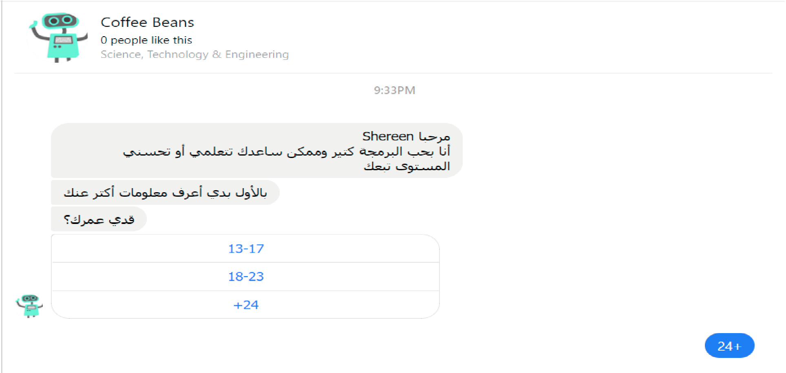

# Description

*The Bot acts as a middle man between the user and the institute he wish to contact. furthermore, the Bot has the ability to help the user decide what he wants if the Bot senses an uncertentity or randomness in the users questions. The randomness is defined by general, non relative questions that makes the Bot answer non helpful answers. The user should realise that he is communicating with a Bot connected to a data base, to establish the comfort of knowing that answers are based on academic research and categorizing. Answers do not only consist of information the user requested, it should also be formatted in a way that makes further decision-making easier and more productive.*
  
  

 
 *The concept of the Bot is simple. First of all it takes the question, analyse it using NLP, perform a search depending on the tokens provided by the NLP module, return the search output as the answer, which is simplified and explained by formatting it before delivering to the user.*
 

## Questions

### What problem/challenge will the chatbot solve? 
*The chatbot's main purpose is to guide education seekers to their desired destination, whether it's a university, school or even a peer for discussion. A student's fear and shyness is what holds him back from asking questions in the real world and calling the universities he wishes to apply for. However, that won't be an issue if he could simply ask the Bot and get his answers so that he could focus on his real target, which is to do his best to get where he wants.The chatbot will be the student's friend that travels all around, gather the information he requested, present it in a readable format which allows the student to consider all the possibilities he has. *

### How will the chatbot solve it?
*The chatbot is connected to a database that contains all the details about universities and other educational institutes. The chatbot requests one or multiple universities information regarding what they require for application, when do they open their doors, and contact information, then those details are put in clear, user friendly shapes to be presented to the student.*

### Who is the primary user and how will the chatbot engage the user?
The bot is useful for students who wish to apply for an educational institute as freshman students, or those who seek to transfer from their current position to another place they desire. Moreover, teachers can also benefit from the bot by searching for institutes that are looking for an educational staff to hire. voluntary activities are also included in the data base for those who wish to volunteer as teachers or trainers. The bot also provides information on educational courses that are open for everyone, especially language courses and craft learning. 

### What activity does the chatbot facilitate that would not otherwise be possible? 
*Most refugee students in Turkey quit the idea of applying to educational institutes because they are not fully aware of the possibilities they have, or simply because they are shy of contacting anyone to ask about what they could do. The chatbot breaks these boundaries by answering students questions with clear, simple yet full information about the widest possible range of educational institutes all around the country.*

### What challenges do you expect to encounter?
*The major challenge would be the making of the data base. We will try to gather all the data from every educational institute in Turkey to cover the wide spread of refugees across the country. A second issue related to the data base is the need to constantly update it by periodically going over every educational institute and detecting any changes in details. Other than maintain the data base, no more difficulties are expected to be faced.*

